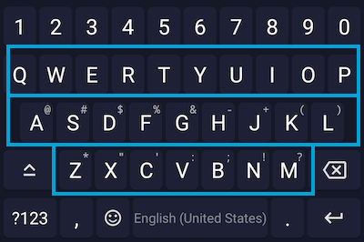
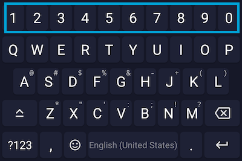
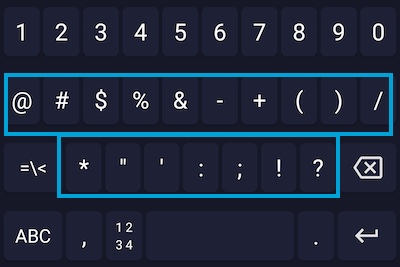
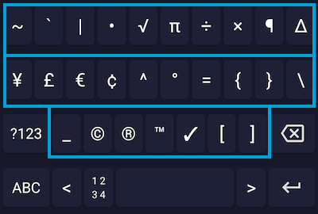
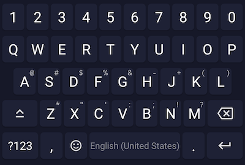

# Notes on contributing

Full original document at [../CONTIBUTING.md](../CONTIBUTING.md)

### Adding the layout

Since v0.3.10-beta05 it is possible to add custom layouts for all types.

To add a new layout, head to [`app/src/main/assets/ime/text`](app/src/main/assets/ime/text) and then select
the correct sub-directory for the type of layout you want to add. In most cases
this will be `characters` to add a layout like QWERTY etc.

📌 [florisboard/qwerty.json at master · CouldBeThis/florisboard](https://github.com/CouldBeThis/florisboard/blob/master/app/src/main/assets/ime/keyboard/org.florisboard.layouts/layouts/characters/qwerty.json)

For the `code` field of each key, make sure to use the UTF-8 code. An
useful tool for finding the correct code is [unicode-table.com](https://unicode-table.com/en/).
From there, you search for your letter and then use the HTML code, but without the `&#;`
For internal codes of functional or UI keys, see
[`app/src/main/java/dev/patrickgold/florisboard/ime/text/key/KeyCode.kt`](app/src/main/java/dev/patrickgold/florisboard/ime/text/key/KeyCode.kt).

The label is equally important and should always match up with the defined
code. If `code` and `label` don't match up, FlorisBoard won't crash but
it will most likely lead to confusion in the key processing logic.

Any accents or diacritics that should be exposed via long press can be
added at [`app/src/main/assets/ime/text/characters/extended_popups/<languageTag_name_here>.json`](app/src/main/assets/ime/text/characters/extended_popups).
For each key, you can add 1 main and several relevant accents. The main
accent should be used for accents which are important for the language
you add. The main field is used for determining if a hint or an accent
should take priority, so please make sure to leave main empty and just
use relevant for accents which are not-so important.

For popups of non-`characters` layout, simply add the popup directly to
each key via the `popup` field.

📌 [florisboard/en.json at master · CouldBeThis/florisboard](https://github.com/CouldBeThis/florisboard/blob/master/app/src/main/assets/ime/keyboard/org.florisboard.localization/popupMappings/en.json)

📌 Useful files:

Layouts: [florisboard/app/src/main/assets/ime/keyboard/org.florisboard.layouts/layouts](https://github.com/CouldBeThis/florisboard/tree/master/app/src/main/assets/ime/keyboard/org.florisboard.layouts/layouts)

[characters](https://github.com/CouldBeThis/florisboard/tree/master/app/src/main/assets/ime/keyboard/org.florisboard.layouts/layouts/characters): [qwerty.json](https://github.com/CouldBeThis/florisboard/blob/master/app/src/main/assets/ime/keyboard/org.florisboard.layouts/layouts/characters/qwerty.json) - 3 rows, letters only

[numericRow](https://github.com/CouldBeThis/florisboard/tree/master/app/src/main/assets/ime/keyboard/org.florisboard.layouts/layouts/numericRow): [western_arabic.json](https://github.com/CouldBeThis/florisboard/blob/master/app/src/main/assets/ime/keyboard/org.florisboard.layouts/layouts/numericRow/western_arabic.json) - primary number row

[symbols](https://github.com/CouldBeThis/florisboard/tree/master/app/src/main/assets/ime/keyboard/org.florisboard.layouts/layouts/symbols): [western.json](https://github.com/CouldBeThis/florisboard/blob/master/app/src/main/assets/ime/keyboard/org.florisboard.layouts/layouts/symbols/western.json) - useful and less useful symbols

[symbols2](https://github.com/CouldBeThis/florisboard/tree/master/app/src/main/assets/ime/keyboard/org.florisboard.layouts/layouts/symbols2): [western.json](https://github.com/CouldBeThis/florisboard/blob/master/app/src/main/assets/ime/keyboard/org.florisboard.layouts/layouts/symbols2/western.json)

**where is this?:**

[western_additional_symbols.json](https://github.com/CouldBeThis/florisboard/blob/master/app/src/main/assets/ime/keyboard/org.florisboard.layouts/layouts/symbols/western_additional_symbols.json) - do not think it is used?

- [charactersMod](https://github.com/CouldBeThis/florisboard/tree/master/app/src/main/assets/ime/keyboard/org.florisboard.layouts/layouts/charactersMod): [default.json](https://github.com/CouldBeThis/florisboard/blob/master/app/src/main/assets/ime/keyboard/org.florisboard.layouts/layouts/charactersMod/default.json) - default punctuation, shift, space etc
- [extension](https://github.com/CouldBeThis/florisboard/tree/master/app/src/main/assets/ime/keyboard/org.florisboard.layouts/layouts/extension): [clipboard_cursor_row.json](https://github.com/CouldBeThis/florisboard/blob/master/app/src/main/assets/ime/keyboard/org.florisboard.layouts/layouts/extension/clipboard_cursor_row.json) - copy, paste etc
- [numeric](https://github.com/CouldBeThis/florisboard/tree/master/app/src/main/assets/ime/keyboard/org.florisboard.layouts/layouts/numeric)
  - [western_arabic.json](https://github.com/CouldBeThis/florisboard/blob/master/app/src/main/assets/ime/keyboard/org.florisboard.layouts/layouts/numeric/western_arabic.json) - number pad, 1 at top
  - [western_arabic_pc.json](https://github.com/CouldBeThis/florisboard/blob/master/app/src/main/assets/ime/keyboard/org.florisboard.layouts/layouts/numeric/western_arabic_pc.json) - number pad, 1 at bottom
- [numericAdvanced](https://github.com/CouldBeThis/florisboard/tree/master/app/src/main/assets/ime/keyboard/org.florisboard.layouts/layouts/numericAdvanced)
  - [western_arabic.json](https://github.com/CouldBeThis/florisboard/blob/master/app/src/main/assets/ime/keyboard/org.florisboard.layouts/layouts/numericAdvanced/western_arabic.json) symbols, bracket and numbers
  - [western_arabic_pc.json](https://github.com/CouldBeThis/florisboard/blob/master/app/src/main/assets/ime/keyboard/org.florisboard.layouts/layouts/numericAdvanced/western_arabic_pc.json) symbols, bracket and numbers
- 
- [phone](https://github.com/CouldBeThis/florisboard/tree/master/app/src/main/assets/ime/keyboard/org.florisboard.layouts/layouts/phone): [telpad.json](https://github.com/CouldBeThis/florisboard/blob/master/app/src/main/assets/ime/keyboard/org.florisboard.layouts/layouts/phone/telpad.json) - number pad, 1 at top
- [phone2](https://github.com/CouldBeThis/florisboard/tree/master/app/src/main/assets/ime/keyboard/org.florisboard.layouts/layouts/phone2): [telpad.json](https://github.com/CouldBeThis/florisboard/blob/master/app/src/main/assets/ime/keyboard/org.florisboard.layouts/layouts/phone2/telpad.json) - number pad, symbols only

- - 
- [symbols2Mod](https://github.com/CouldBeThis/florisboard/tree/master/app/src/main/assets/ime/keyboard/org.florisboard.layouts/layouts/symbols2Mod)
  - [default.json](https://github.com/CouldBeThis/florisboard/blob/master/app/src/main/assets/ime/keyboard/org.florisboard.layouts/layouts/symbols2Mod/default.json) - useful and less useful symbols (only a few of them)
- [symbolsMod](https://github.com/CouldBeThis/florisboard/tree/master/app/src/main/assets/ime/keyboard/org.florisboard.layouts/layouts/symbolsMod)
  - [default.json](https://github.com/CouldBeThis/florisboard/blob/master/app/src/main/assets/ime/keyboard/org.florisboard.layouts/layouts/symbolsMod/default.json) - useful and less useful symbols (only a few of them)

## Adding a new dictionary for a language

Currently the suggestions implementation is highly experimental and will
get a major if not complete rework, so dictionaries are currently not
accepted.

## Bug reporting

This kind of contribution is the most important, as it tells where
FlorisBoard has flaws and thus should be improved to maximize stability
and user experience. To make this process as smooth as possible, please
use the pre-made [issue template](.github/ISSUE_TEMPLATE/bug_report.md)
for bug reporting. This makes it easy for us to understand what the bug
is and how to solve it.

### Capturing error logs

Logs are captured by FlorisBoard's crash handler, which gives you the
ability to copy it to the clipboard and paste it in GitHub. This is the
preferred way to capture logs.

Alternatively, you can also use ADB (Android Debug Bridge) to capture
the error log. This is recommended for experienced users only.

## Donating

If none of the above options are feasible for you but you still want to
show your support, you can also buy me a coffee, so I can stay up all night
and chase away bugs or add new cool stuff :)
See the `Sponsors` button for available options!
